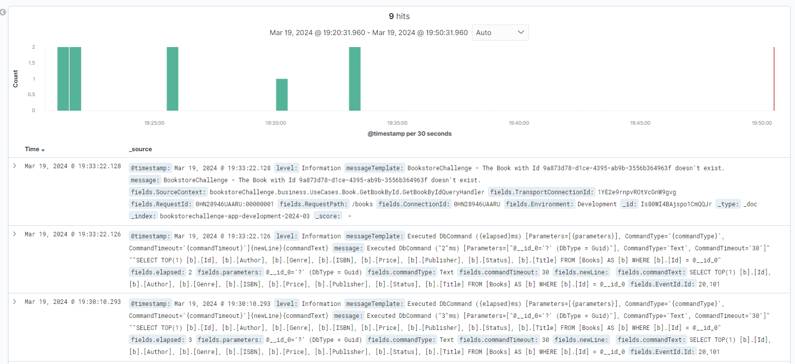

# Bookstore App Challenge

## 1. The Design Challenge

First decision made was based on what architechture should be used in this particular case. As the challenge says, "The application must support the use case of book browsing/search, shopping cart, payment and shipping." This statement, combined with scalability and availability, makes the microservices architecture a good option for this case. This way it is possible to scale each microservice according to the need. When we relate availability to microservices, in the case of the proposed challenge, we will not have to worry that, if there is a problem with the book search service, the other services will stop working, since each service is independent and has their own database.
 
When it comes to availability for all the services, we can use Cloud services instead of On Premise.
 
For realiability, error will be handled using the ELK Stack for logging and monitoring the errors that might happen during the services runtime. When it comes to avoid unauthorized access to the services, OAuth 2.0 is the chosen option.
 
For the maintainability, a clean architecture is the option. The clear separation of concerns makes maintance easy. With the use of a Vertical Slice Architecture, the maintainability can be easier since we start treating each request as a distinct use case. This way, any change or bug fix is made on the same "slice".
 
At last, for the performance, the use of WebSockets is the better option when it comes to low latency, response time and high throughput.


## 2. The Code Challenge

For this project, I chose to develop part of the microservice defined as bookstore.search.
The project has two book searches, one search for all books and a more specific book search according to the Id provided, with data stored in a SQL database.
The project also saves logs in Elasticsearch, which are consumed by Kibana for future analysis.

### Steps for configuration

#### 1. Prerequisites
Be sure to the following programs installed:
* Docker
* Postman

#### 2. Clone repository
Clone the current repository to your local machine.

#### 3. Run Services
Open a Windows Power Shell and go to the folder where you cloned the repository. 
Run the following command:

```
docker-compose up -d
```

This command will run all the services we need. 
In the docker application, you will have the following services: sqlserverdb, kibana, elasticsearch and bookstore.search.

Now, we can test our application.
A few data will be automatically seed into the database for this test purpose.

#### 4. Test app

Now that we have all of our services running, we'll connect to our app using Websocket. In order to do this, we will use Postman:
* Open Postman
* Go to **New** and select **WebSocket**
* In the "Enter URL" box, copy the following URL: **wss://localhost:5009/books**
* Press **Connect**

At this point, you should have a message saying **Connected to wss://localhost:5009/books**. 

* In the "Compose message" box, add the following text: **{"protocol":"json","version":1}**

This is a "Handshake". It's the first step to start sending requests to our application.

NOTE: See that square next to the last bracket? It's a special character, you need to copy that too, otherwise, it won't work.

After adding the previous text to thebox, press **Send**. If everything works fine, server will send a return message.

##### 4.1. GetAllBooks
To test the GetAllBooks, add the following text to the "Compose message" box and press Send:

```
{"arguments":[],"invocationId":"0","target":"GetAllBooks","type":1}
```

##### 4.2. GetBookById
To test the GetBookById, add the following text to the "Compose message" box and press Send:

```
{"arguments":["6789bb44-7367-4c69-9972-61f906aabb5d"],"invocationId":"0","target":"GetBookById","type":1}
```

##### 4.3. GetBookById - Error
The GetBookById - Error test won't return a error to us, but it will generate a log that we will check it later.

To test the GetBookById - Error, add the following text to the "Compose message" box and press Send:

```
{"arguments":["9a873d78-d1ce-4395-ab9b-3556b364963f"],"invocationId":"0","target":"GetBookById","type":1}
```

##### 4.4. Disconnect
In order to disconnect, press the **Disconnect** button so we can close our communication with the Websocket.

#### 5. Logs

The application generate logs se we can track errors, information or any other logs we need. To check those logs, follow these steps

* Access Kibana URL: http://localhost:5601/
* Go to **Menu**, **Kibana** - **Discover** and finally **Create index pattern**
* In the "index-name-" box, write the following:

```
bookstorechallenge-*
```
* Click in "Next step"
* In the **Time field** option, select **@timestamp**
* Click in "Create index pattern"
* Go to **Menu**, **Kibana** - **Discover**

After these steps, you'll have somthing like this:



We can search for the specific log that generated an error by adding in the "Search" box the following search:

```
message: * 9a873d78-d1ce-4395-ab9b-3556b364963f
```

This will search all the logs that the message contains the Id we know that cause an issue.

We can also search for

```
level: * Information
```

or

```
level: * Error
```

And this will return logs saved and specified at the selected level.


