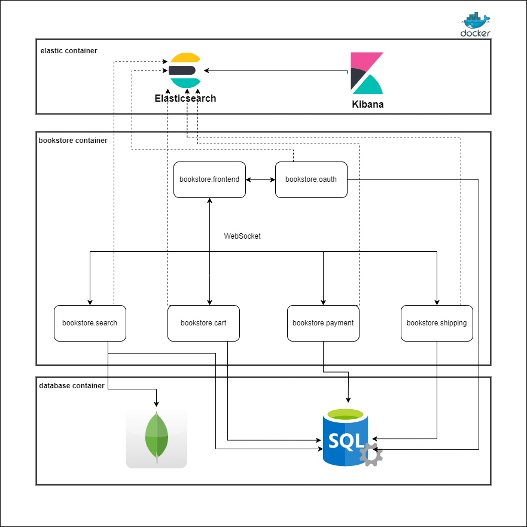

# Bookstore App Challenge

## 1. The Design Challenge

First decision made was based on what architechture should be used in this particular case. As the challenge says, "The application must support the use case of book browsing/search, shopping cart, payment and shipping." This statement, combined with scalability and availability, makes the microservices architecture a good option for this case. This way it is possible to scale each microservice according to the need. When we relate availability to microservices, in the case of the proposed challenge, we will not have to worry that, if there is a problem with the book search service, the other services will stop working, since each service is independent and has their own database.
 
When it comes to availability for all the services, we can use Cloud services instead of On Premise.
 
For realiability, error will be handled using the ELK Stack for logging and monitoring the errors that might happen during the services runtime. When it comes to avoid unauthorized access to the services, OAuth 2.0 is the chosen option.
 
For the maintainability, a clean architecture is the option. The clear separation of concerns makes maintance easy. With the use of a Vertical Slice Architecture, the maintainability can be easier since we start treating each request as a distinct use case. This way, any change or bug fix is made on the same "slice".
 
At last, for the performance, the use of WebSockets is the better option when it comes to low latency, response time and high throughput.

## 2. The Code Challenge